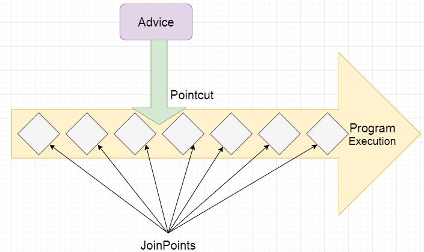

AOP Note
---

To quickly summarize, AOP stands for aspect orientated programming. Essentially, it is a way for adding behavior to existing code without modifying that code.
An aspect can be created in spring boot with help of annotations **@Aspect** annotation and registering with bean container with **@Component** annotation.


[link](https://www.javainuse.com/spring/spring-boot-aop)

>**@Aspect :** Declares the class as aspect.

>**@Pointcut :** Declares the pointcut expression.
 
>**@Before :** Advice that executes before a join point, but which does not have the ability to prevent execution flow proceeding to the join point (unless it throws an exception).

>**@AfterReturning :** Advice to be executed after a join point completes normally.

>**@AfterThrowing :** Advice to be executed if a method exits by throwing an exception.

>**@After :** Advice to be executed regardless of the means by which a join point exits (normal or exceptional return).

>**@Around :** Advice that surrounds a join point such as a method invocation.

Maven pom.xml
```
<dependency>
  <groupId>org.springframework.boot</groupId>
  <artifactId>spring-boot-starter-aop</artifactId>
</dependency>
```
application.properties
```
#spring.aop.auto = false
```
Application annotation
```
@EnableAspectJAutoProxy(proxyTargetClass = true)
```